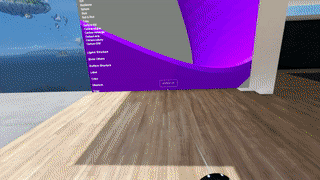
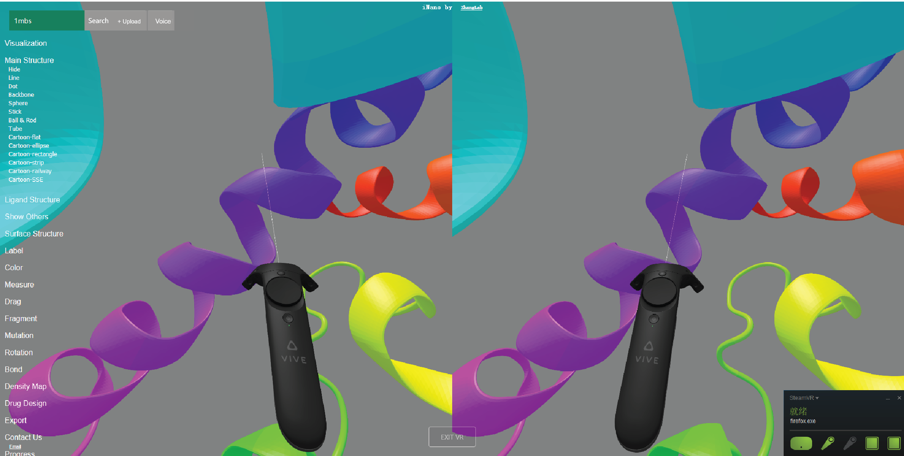

# VRmol: Virtual Reality for Molecular Structures 

## Introduction

We leverage the most cutting-edge computational technologies to develop a virtual reality (VR) system - VRmol - that provides the visualization and analysis of macromolecule structures in an infinite virtual environment on the web. VRmol is natively built with WebVR technology, providing all structural analysis functions in a fully immersive, inspiring virtual environment. It is convenient to use, runs on internet and requires no software downloading and installation. And by connecting to a number of cloud-based genomic and drug databases, it provides an integrative platform to perform advanced structural and translational research. It can be freely accessed online by typing [https://VRmol.net](https://VRmol.net?from=github) in VR-supported browser. 

## Demo



## News
 - 05/17/2019: VRmol is return to normal.
 - 05/16/2019: The service provider is sufferring of Network Rounte Issue, VRmol server is outage.
 - 04/27/2019: VRmol is being on show at Tsinghua's 108th anniversary. [News from Tsinghua](http://life.tsinghua.edu.cn/publish/smkx/11192/2019/20190429100026441636257/20190429100026441636257_.html)
 - 02/27/2019: VRmol is applied in teaching structural biology cource at Tsinghua University.

## Documentation

Tutorials of VRmol can be accessed at [here](https://vrmol.net/docs).

VRmol provides two modes:
- [**VR Mode**](https://vrmol.net/docs/#header-n5340) will guide you to experience VRmol in Virtual Reality environment.
- [**nonVR Mode**](https://vrmol.net/docs/#header-n5609) will guide you to experience VRmol on the desktop.

### Video Tutorials

- [**Entering VR Scene**](https://vrmol.net/docs/#header-n59) [[YouTube]](https://www.youtube.com/watch?v=k-qsnA9e5-o)
- [**Loading Structure**](https://vrmol.net/docs/#header-n72) [[YouTube]](https://www.youtube.com/watch?v=qAvqJ8WrTKA)
- [**Measurement**](https://vrmol.net/docs/#header-n227) 
- [**Drag Structure elements**](https://vrmol.net/docs/#header-n237) 
- [**Structure Editing**](https://vrmol.net/docs/#header-n251) 
- [**Genome Variations**](https://vrmol.net/docs/#header-n259) 
- [**Interactive Docking**](https://vrmol.net/docs/#header-n267) [[YouTube]](https://www.youtube.com/watch?v=iblEtcxJTos)
- [**Entering VR Scene**](https://vrmol.net/docs/#header-n59) 
- [**Fragmentation  in nonVR mode**](https://vrmol.net/docs/#header-n459)
- [**Structure Editing  in nonVR mode**](https://vrmol.net/docs/#header-n468)
- [**Genome Variations  in nonVR mode**](https://vrmol.net/docs/#header-n476)
- [**Interactive Docking in nonVR mode**](https://vrmol.net/docs/#header-n489)


## VR Device requirements

 VR devices such as HTC Vive, Oculus Rift, and Microsoft Mix Reality are well-supported by VRmol. More details can be seen at [documentation](https://vrmol.net/docs/#header-n5342).


## Framework

The framework of VRmol.


## Screenshot

A screenshot of structure visualization with stereo view.



## Sharing by URL


### URL Options
You can save a specific structural representation scene by saving operation options setting in VRmol as a URL, like `https://vrmol.net/index.html?id=1dfb`. And then you can load and share the scene by opening this previously-saved URL in the web browser or embedding it into your own website by using `iframe`, such as

```html
<iframe src="https://vrmol.net/index.html?id=1dfb" />
```


The options and their data types supported in VRmol are shown in the table below.

| Options    | Data Type |Value  |Comment|
| :------ | :------ |:------ |:------ |
| id | String|PDB code|4 charactors|
|panelShow|Integer|Show:1, Hide:0|Show menu panel or not|
|mainMode|Integer|LINE:1, DOT:2, BACKBONE:3, SPHERE:4, STICK:5, BALL_AND_ROD:6, TUBE:7, RIBBON_FLAT:8, RIBBON_ELLIPSE:9, RIBBON_RECTANGLE:10, RIBBON_STRIP:11, RIBBON_RAILWAY:12, CARTOON_SSE:13, SURFACE:14|Main Structure Representation|
|showSurface|Integer|Show:1, Hide:0|Show surface panel or not|
|surfaceOpc|Float|0~1|Transparency of surface|
|surfaceType|Integer|Van der Waals surface:1, solvent excluded surface:2, solvent accessible surface:3, molecular surface:4|Surface type|
|colorMode|Integer|Element:601, Residue:602, Secondary Structure:603, Chain:604, Representation:605, B-Factor:606, Spectrum:607, Chain Spectrum:608, Hydrophobicity:609|Color schemes|
|travel|Integer|Show:1, Hide:0|Enter travel mode or not|
|vmode|String|desktop, vr|Visualization Mode|
|fragment|String|['a', 7, 6]|Fragmentation, label the 7th residue with `Ball & Rod` style|


### Examples for API 


  1. Present structure (PDB code:`1MBS`) with `Ball & Rod` style and hide the menu panel.  [Try it](https://vrmol.net/index.html?id=1mbs&panelShow=0&mainMode=6)
```html
<iframe src="https://vrmol.net/index.html?id=1mbs&panelShow=0&mainMode=6" />
```


  2. Present structure (PDB code:`1DDB`) with `Tube` style and show its Van der Waals surface with transparency (0.5), and hide the menu panel. [Try it](https://vrmol.net/index.html?id=1dfb&panelShow=0&mainMode=7&showSurface=1&surfaceOpc=0.5&surfaceType=1)
```html
<iframe src="https://vrmol.net/index.html?id=1dfb&panelShow=0&mainMode=7&showSurface=1&surfaceOpc=0.5&surfaceType=1"  />
```

  3. Present structure (PDB code:`1F5X`) with the 7th residue labeled with `Ball & Rod` style in VR mode. [Try it](https://vrmol.net/?id=1f5x&fragment=['a',7,6]&vmode=vr)
```html
<iframe src="https://vrmol.net/?id=1f5x&fragment=['a',7,6]&vmode=vr"  />
```

  4. Present structure (PDB code:`2HYY`) with surface in VR. [Try it](https://vrmol.net/index.html?id=2hyy&panelShow=1&mainMode=13&showSurface=1&surfaceOpc=1&surfaceType=1&colorMode=609&vmode=vr)
```
https://vrmol.net/index.html?id=2hyy&panelShow=1&mainMode=13&showSurface=1&surfaceOpc=1&surfaceType=1&colorMode=609&vmode=vr
```

## Deploy VRmol on your own server

  - Download the code into the apache server web directory
  - Set `SERVERURL` as your URL (like https://example.com) at `libs/core.js`
  - Start the Speech Recognition service by run:
    ```python
    python3 server/speech/sr.py
    ```
  - Installation of external tools
     - [AutoDock Vina](http://vina.scripps.edu/)
     - [MGLTools](http://mgltools.scripps.edu/)
     - [OpenBabel](http://openbabel.org/wiki/Main_Page)
  - Data files in the Database

> If you deploy VRmol in your local server with a prefix URL `http://localhost` or you do not have a setting of `https`, you should delete the `.htaccess` file. While without setting `https`, you would not access the Speech Recognition function.

Server Tools
  - Linux/Windows/macOS [Apache](https://httpd.apache.org/)
  - Integretive tool for Linux [LAMP](https://github.com/teddysun/lamp)
  - Integretive tool for Windowns [WAMP](http://www.wampserver.com/en/)

## Release Versions
  - [Releases](https://github.com/kuixu/VRmol/releases)
  - [v0.1](https://github.com/kuixu/VRmol/tree/v0.1)

## Citation

Paper: [Biorxiv](https://www.biorxiv.org/content/early/2019/03/27/589366.1)
```
@article {Xu589366,
	author = {Xu, Kui and Liu, Nan and Xu, Jingle and Guo, Chunlong and Zhao, Lingyun and Wang, Hong-wei and Zhang, Qiangfeng Cliff},
	title = {VRmol: an Integrative Cloud-Based Virtual Reality System to Explore Macromolecular Structure},
	elocation-id = {589366},
	year = {2019},
	doi = {10.1101/589366},
	publisher = {Cold Spring Harbor Laboratory},
	URL = {https://www.biorxiv.org/content/early/2019/03/27/589366.1},
	eprint = {https://www.biorxiv.org/content/early/2019/03/27/589366.1.full.pdf},
	journal = {bioRxiv}
}

```

## Acknowledgments

VRmol is developed based on [three.js](https://threejs.org) and [WebVR](https://webvr.rocks/), and we would like to express our special thanks to those open-source projects below.
  - [Web3DMol](https://web3dmol.net) - for PDB file loading and parsing
  - [GLmol.js](https://github.com/biochem-fan/GLmol) - for calculating surface 
  - [Chroma.js](https://github.com/gka/chroma.js) - for color handling
  - [gunzip.min.js](https://github.com/imaya/zlib.js) - for decompress EM map files
  - [AutoDock vina](http://vina.scripts.edu) - for Docking Drugs in VR scene
  - [MGLTools](http://mgltools.scripps.edu/) - for preparing docking files
  - [OpenBabel](http://openbabel.org/wiki/Main_Page) - for convert docking results

