# Tutorial: Intro to iNano

<!--we can see these two websites-->

<!--for content, we can reference to Web3DMol at https://web3dmol.net/help.html -->

<!--for html style, we can reference to  https://reactjs.org/tutorial/tutorial.html -->

## Before We Start the Tutorial

Welcome to the iNano Tutorial. The following pages will take you on a brief self-guided tour of the structure visualization and integrative analysis abilities in Virtual Reality of the iNano. We will show a model with all if options in iNano during this tutorial. It will give you a deep understanding of iNano.

The tutorial is divided into two sections:

- [Introduction](https://reactjs.org/tutorial/tutorial.html#setup-for-the-tutorial) will give you **a starting point** to follow the tutorial.
- [Overview](https://reactjs.org/tutorial/tutorial.html#overview) will teach you the fundamentals of iNano: functions and features.
- [VR Mode](https://reactjs.org/tutorial/tutorial.html#adding-time-travel) will teach you use iNano in Virtual Reality.
- [Desktop Mode](https://reactjs.org/tutorial/tutorial.html#completing-the-game) will teach you use iNano on the desktop.
- [Sharing URL]() will teach you use iNano with a sharing URL which can be embeded into your own webpage with only a single line HTML code.

You don’t have to complete all of the sections at once to get the value out of this tutorial. Try to get as far as you can — even if it’s one or two sections.

It’s fine to copy and paste code as you’re following along the tutorial, but we recommend to try it by hand with VR devices. This will help you develop a muscle memory and a stronger understanding.

## Introduction

iNano, a for molecular structure visualization and integrative analysis. iNano connects to multi-source translational and drug data from the cloud in a fully immersive VR environment. The immersive experience of iNano improves the visualization, calculation, and editing of complex structures. iNano is web-based  system and connects to disease-related and drug databases, and thus can serve as an integrative platform to aid in structure-based translational researches and drug design. iNano is freely available at <https://inano.zhanglab.net>.

- iNano enables users to explore macromolecular structures in virtual reality from a web browser.
- iNano provides a cloud-based platform to access multiple resources for integrated structural studies.

## Overview

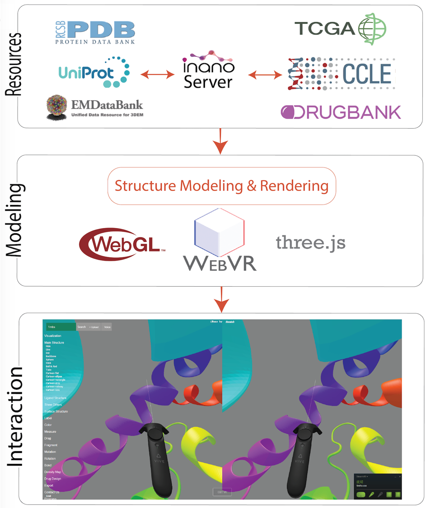

## VR Mode 

### Screen shot

video

### Menu

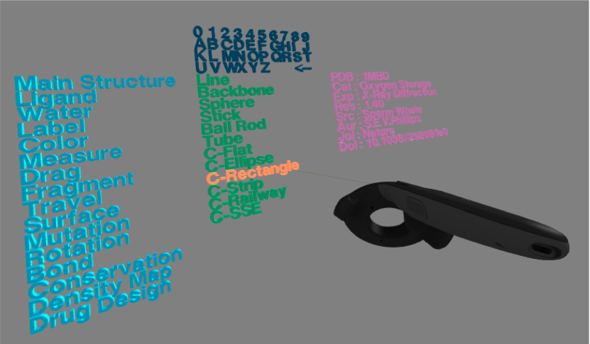

### Representation

iNano provide different representation modes, which can be changed in "Main Structure" in the menu.

- **Line**

  

- **Backbone**

  

- **Sphere**

  

- **Stick**

  

- **Ball & Rod**

  

- **Tube**

  

- **Ribbon-flat**

  

- **Ribbon-ellipse**

  

- **Ribbon-rectangle**

  

- **Ribbon-strip**

  

- **Ribbon-railway**

  

- **Ribbon-SS**

  

#### Ligand

iNano shows ligand with main structure or separately.

 

 

 

 

#### Water

#### Surface

iNano provides different mode and transparency for structure surfaces. Surface includes Van der Waals surface, solvent accessible surface, solvent excluded surface and molecular surface.

### Color Schema

  

### Computing the distance in VR
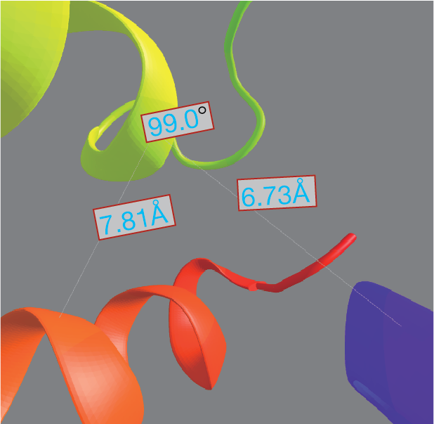
### Structure Editing

### Fragmentation

Users need to choose the region and representation style in panel.

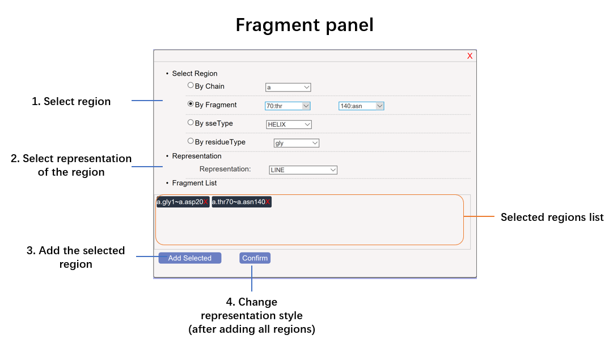

Here is an example:

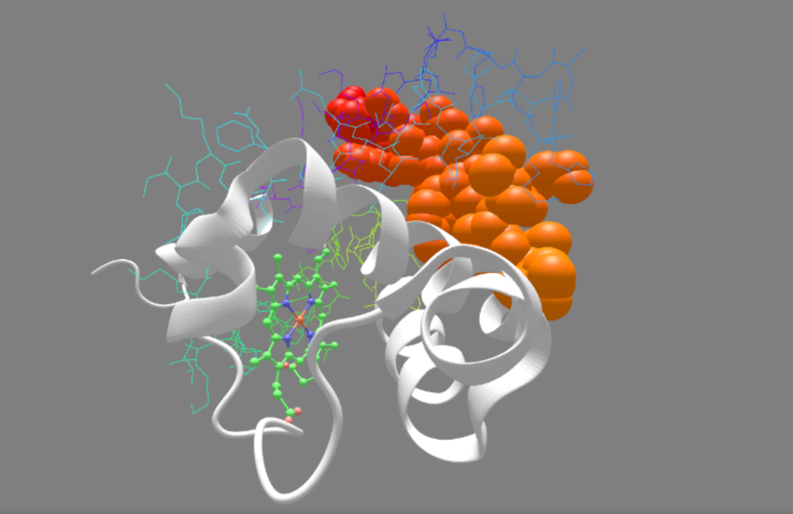

### Mutating a Residue

### Visualize Genome Variations
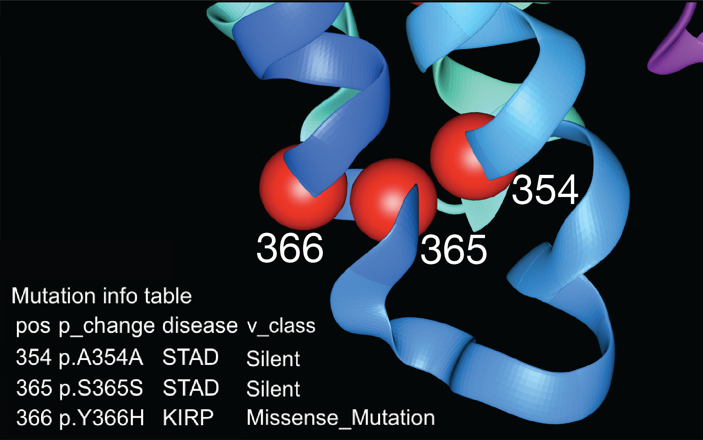
### Drugs

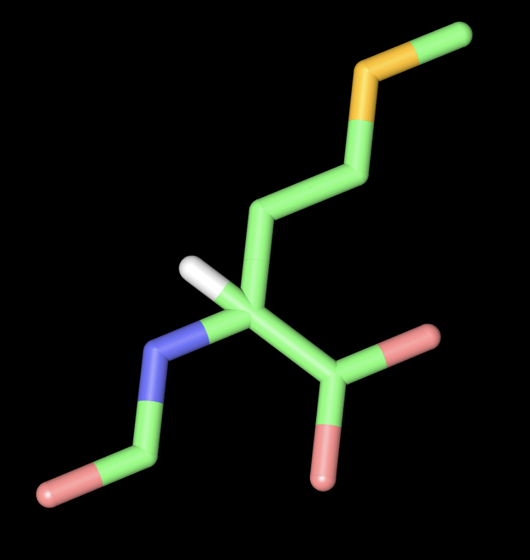

### Interactive Docking
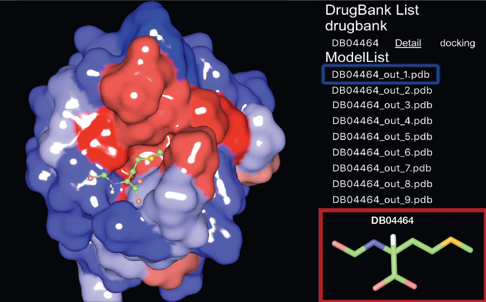
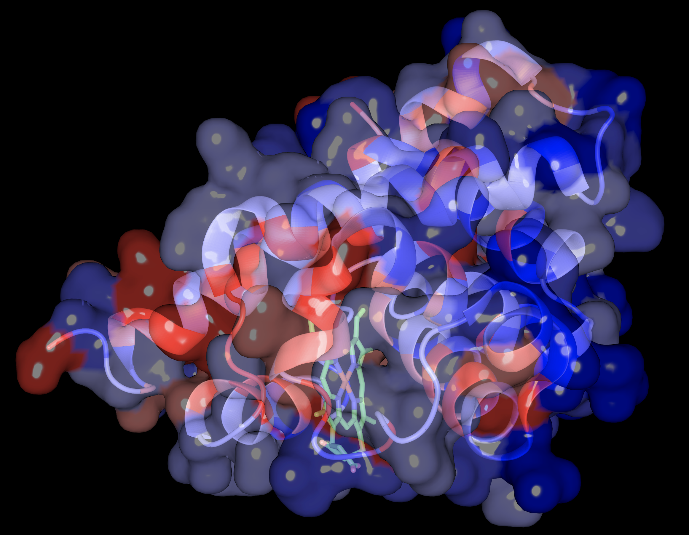

### Density Map

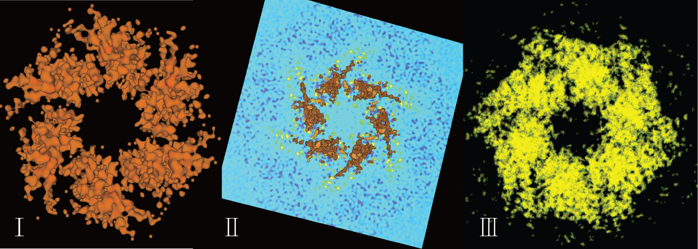
### Spherical View
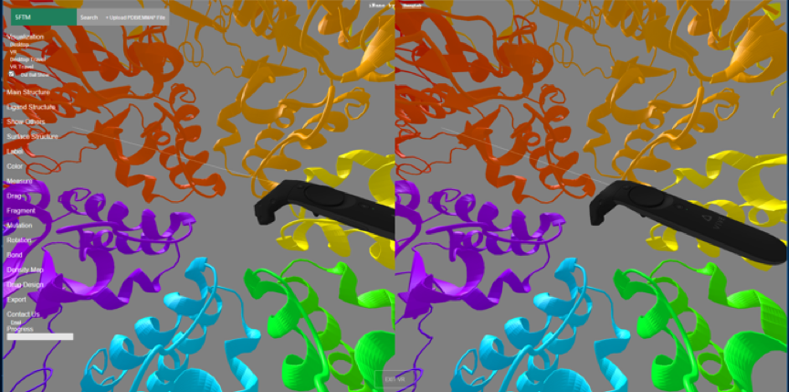
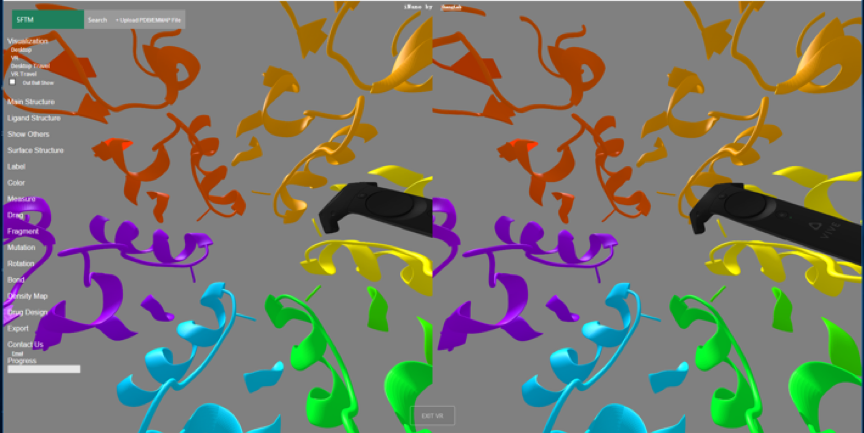

### Speech Recognition

Button for speech recognition is located at the top-left of the page.

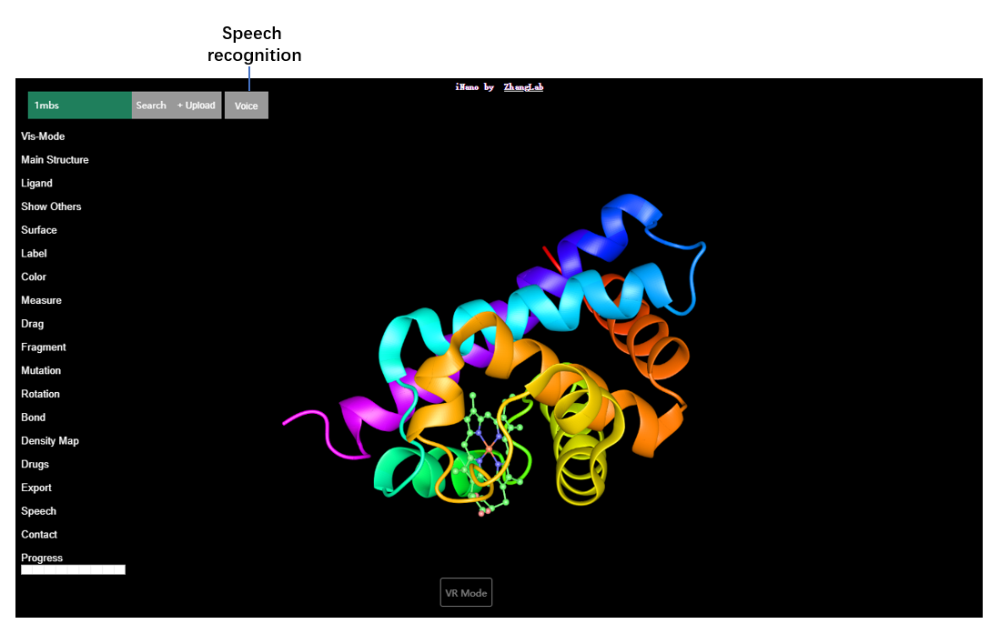

Steps for Speech Recognition:

1. Choose a language. The default language is English.
2. Press down the button.
3. Hold down the button while speaking the command.
4. Release the button. The recording will finish and uploaded to server automatically.
5. Wait a few seconds (depending on the length of recording and network conditions), after the recognition is completed, iNano will operate according to the voice command.

#### Language

iNano now support both English and Chinese speech recognition.  Users could first click the "Speech" item in the menu, then choose the language by clicking the option.

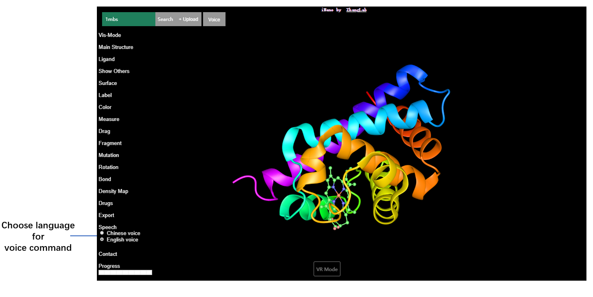

#### Command List

<table>
   <tr>
      <td>Category</td>
      <td>Command</td>
   </tr>
   <tr>
      <td rowspan="3">Visualization Mode</td>
      <td>go to desktop mode</td>
   </tr>
   <tr>
      <td>go to virtual reality mode</td>
   </tr>
   <tr>
      <td>go to travel mode</td>
   </tr>
   <tr>
      <td rowspan="10">Main structure style</td>
      <td>change to dot style</td>
   </tr>
   <tr>
      <td>change to line style</td>
   </tr>
   <tr>
      <td>change to backbone style</td>
   </tr>
   <tr>
      <td>change to sphere style</td>
   </tr>
   <tr>
      <td>change to stick style</td>
   </tr>
   <tr>
      <td>change to ball and rod style</td>
   </tr>
   <tr>
      <td>change to tube style</td>
   </tr>
   <tr>
      <td>change to second structure style</td>
   </tr>
   <tr>
      <td>hide main structure</td>
   </tr>
   <tr>
      <td>show main structure</td>
   </tr>
   <tr>
      <td rowspan="6">Ligand structure style</td>
      <td>change Ligand to line style</td>
   </tr>
   <tr>
      <td>change Ligand to sphere style</td>
   </tr>
   <tr>
      <td>change Ligand to stick style</td>
   </tr>
   <tr>
      <td>change Ligand to ball and rod style</td>
   </tr>
   <tr>
      <td>hide ligand structure</td>
   </tr>
   <tr>
      <td>show ligand structure</td>
   </tr>
   <tr>
      <td rowspan="6">Other</td>
      <td>show water </td>
   </tr>
   <tr>
      <td>hide water</td>
   </tr>
   <tr>
      <td>show hydrogen bond</td>
   </tr>
   <tr>
      <td>hide hydrogen bond</td>
   </tr>
   <tr>
      <td>show mutation</td>
   </tr>
   <tr>
      <td>hide mutation</td>
   </tr>
   <tr>
      <td rowspan="4">Surface</td>
      <td>show the surface of main structure</td>
   </tr>
   <tr>
      <td>show transparency</td>
   </tr>
   <tr>
      <td>show mesh</td>
   </tr>
   <tr>
      <td>hide the surface of main structure</td>
   </tr>
   <tr>
      <td rowspan="8">Color</td>
      <td>color by element</td>
   </tr>
   <tr>
      <td>color by residue</td>
   </tr>
   <tr>
      <td>color by second structure</td>
   </tr>
   <tr>
      <td>color by chain</td>
   </tr>
   <tr>
      <td>color by b-factor</td>
   </tr>
   <tr>
      <td>color by spectrum</td>
   </tr>
   <tr>
      <td>color by hydrophobicity</td>
   </tr>
   <tr>
      <td>color by conservation</td>
   </tr>
   <tr>
      <td rowspan="14">Interaction</td>
      <td>open dragging function</td>
   </tr>
   <tr>
      <td>open labelling function</td>
   </tr>
   <tr>
      <td>rotation</td>
   </tr>
   <tr>
      <td>rotation by x</td>
   </tr>
   <tr>
      <td>rotation by y</td>
   </tr>
   <tr>
      <td>rotation by z</td>
   </tr>
   <tr>
      <td>clockwise rotation</td>
   </tr>
   <tr>
      <td>anticlockwise rotation</td>
   </tr>
   <tr>
      <td>move</td>
   </tr>
   <tr>
      <td>move along x</td>
   </tr>
   <tr>
      <td>move along y</td>
   </tr>
   <tr>
      <td>move along z</td>
   </tr>
   <tr>
      <td>move forward</td>
   </tr>
   <tr>
      <td>move backward</td>
   </tr>
</table>

### Supported Devices

## Desktop Mode Browser Support 

https://threejs.org/docs/index.html#manual/en/introduction/Browser-support

https://caniuse.com/#feat=webgl

### Representation

iNano provide 13 different representation mode, which can be changed in "Main Structure" in the menu.

- **Dot**

  

- **Line**

  

- **Backbone**

  

- **Sphere**

  

- **Stick**

  

- **Ball & Rod**

  

- **Tube**

  

- **Ribbon-flat**

  

- **Ribbon-ellipse**

  

- **Ribbon-rectangle**

  

- **Ribbon-strip**

  

- **Ribbon-railway**

  

- **Ribbon-SS**

  

#### Ligand

iNano shows ligand with main structure or separately.

For ligand, iNano provides 4 styles.

- **Line**

  

- **Sphere**

  

- **Stick**

  

- **Ball & Rod**

  

#### Water

#### Surface

iNano provides different mode and transparency for structure surfaces. Surface includes Van der Waals surface, solvent accessible surface, solvent excluded surface and molecular surface.

### Color Schema

### Fragmentation

Fragments are segments of chains in a molecule. iNano allows users to present fragments by using different representation style in 'Region'. 

Users need to choose the region and representation style in panel.

Here is an example:

## Sharing by URL

